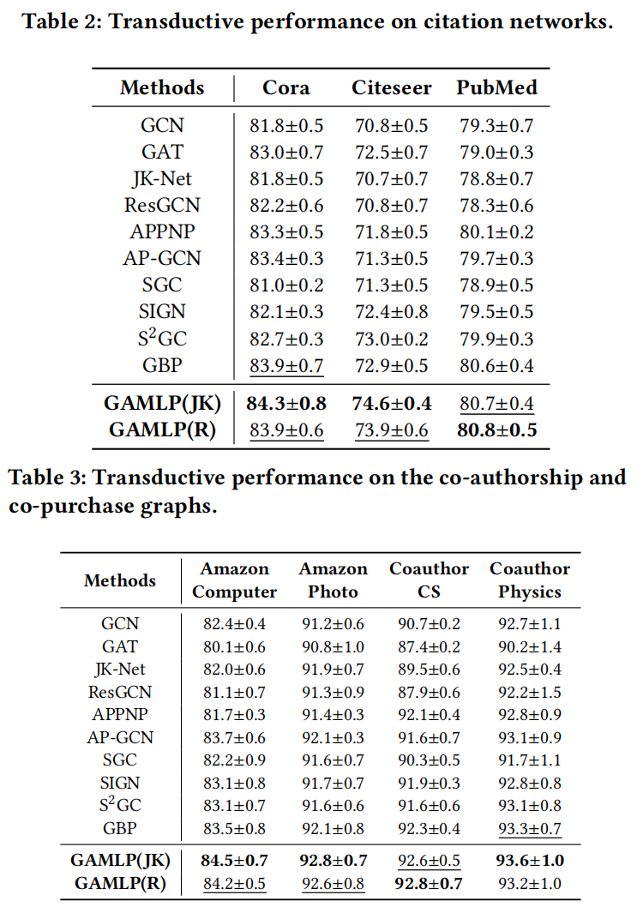
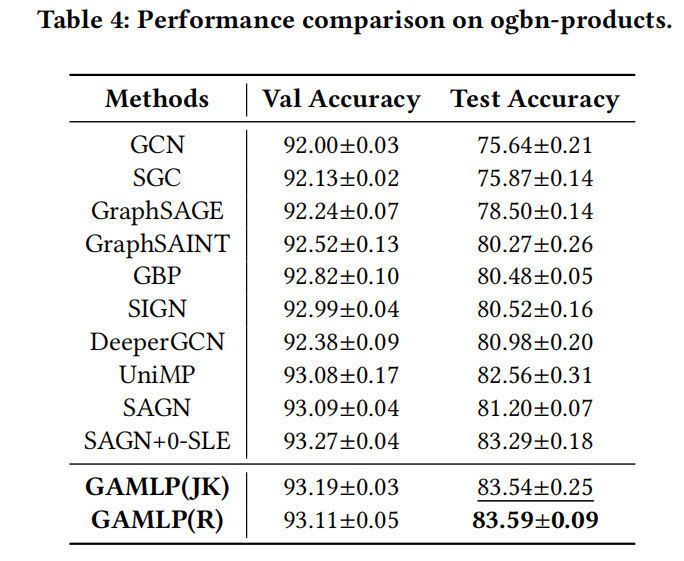
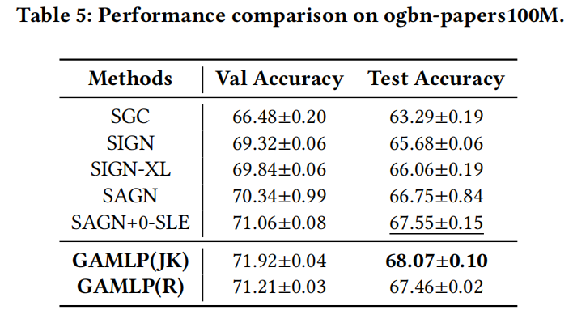
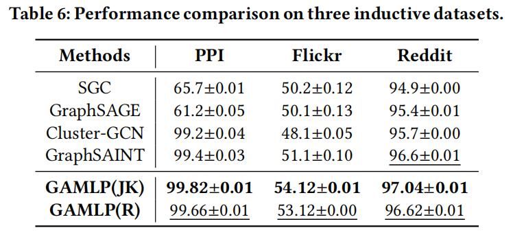
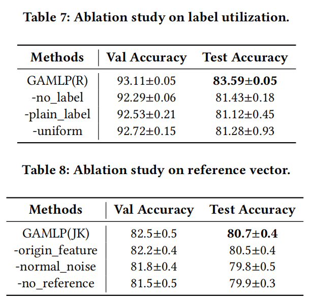

# GAMLP: Graph Attention Multi-Layer Perceptron

This repository is the official implementation of GAMLP.

## Requirements

To install requirements:

```setup
pip install -r requirements.txt
```

## Training

### PPI

```
cd ./ppi
python ppi.py --dataset ppi --method JK_GAMLP --dropout 0.1 --input-drop 0.1 --att-drop 0 --act sigmoid --label-num-hops 3 --num-hops 10 --epochs 800  --n-layers-1 4 --n-layers-2 6 --lr 0.001 --weight-decay 0 --hidden 2048 --seed 42 --att-drop 0 --label-num-hops 9 --use-label --patience 100
```

````
cd ./ppi
python ppi.py --dataset ppi --method R_GAMLP --dropout 0.1 --input-drop 0.1 --att-drop 0 --act sigmoid --label-num-hops 3 --num-hops 10 --epochs 600  --n-layers-1 4 --n-layers-2 6 --lr 0.001 --weight-decay 0 --hidden 2048 --seed 42 --att-drop 0 --label-num-hops 9 --use-label --patience 100
````

### Reddit

```
python main.py --dataset reddit --method JK_GAMLP --dropout 0.7 --input-drop 0 --att-drop 0 --act leaky_relu --batch 1000 --label-num-hops 10 --num-hops 10 --epochs 350 --n-layers-1 2 --n-layers-2 2 --n-layers-3 2 --n-layers-4 2 --lr 0.0001 --weight-decay 0 --hidden 512 --patience 100 --seed 42 --pre-process --use-label --label-drop 0.3 --label-num-hops 4 --weight 1e-7 --num-runs 1 
```

```
python main.py --dataset reddit --method R_GAMLP --dropout 0.7 --input-drop 0 --att-drop 0 --act leaky_relu --batch 1000 --label-num-hops 10 --num-hops 10 --epochs 350 --n-layers-1 2 --n-layers-2 2 --n-layers-3 2 --n-layers-4 2 --lr 0.0001 --weight-decay 0 --hidden 512 --patience 100 --seed 42 --pre-process --use-label --label-drop 0.5 --label-num-hops 4 --weight 1e-7  --num-runs 1 
```

### Flickr

```
python main.py --dataset flickr --method JK_GAMLP --dropout 0.7 --input-drop 0 --att-drop 0 --act leaky_relu --batch 250 --label-num-hops 10 --num-hops 10 --epochs 50 --n-layers-1 2 --n-layers-2 2 --n-layers-3 2 --n-layers-4 2 --lr 0.001 --weight-decay 0 --hidden 512 --patience 100 --seed 42 --pre-process --use-label --label-drop 0.5 --label-num-hops 5 --num-runs 1
```

```
python main.py --dataset flickr --method R_GAMLP --dropout 0.5 --input-drop 0 --att-drop 0 --act leaky_relu --batch 250 --label-num-hops 10 --num-hops 10 --epochs 50 --n-layers-1 2 --n-layers-2 2 --n-layers-3 2 --n-layers-4 2 --lr 0.0001 --weight-decay 0 --hidden 512 --patience 100 --seed 42 --pre-process --use-label --label-drop 0.5 --label-num-hops 5 --num-runs 1
```

### ogbn-products

```
python main.py --method R_GAMLP --epochs 1000 --input-drop 0.5 --att-drop 0.4 --dropout 0.2  --label-drop 0 --pre-process --dataset ogbn-products --num-runs 10 --gpu 6 --eval-every 1 --eval-batch 500000 --act leaky_relu --batch 50000 --patience 300 --n-layers-1 4 --n-layers-2 2 --root  /data1/zwt/ --gpu 0 --seed 0 --hidden 1024
```

```
python main.py --method JK_GAMLP --epochs 700 --train-epochs 200 --input-drop 0.5 --att-drop 0.4 --dropout 0.2  --label-drop 0 --pre-process --dataset ogbn-products --num-runs 10 --gpu 6 --eval-every 1 --eval-batch 50000 --act leaky_relu --batch 50000 --patience 300 --n-layers-1 2 --n-layers-2 2 --n-layers-3 2 --n-layers-4 2 --root  /data2/zwt/ --gpu 0 --seed 0 --hidden 1024
```

```
python main.py --use-label --method R_GAMLP --epochs 400 --train-epochs 0 --dataset ogbn-products --eval-every 10 --act leaky_relu --batch 50000 --eval-batch 500000 --patience 300 --n-layers-1 4 --n-layers-2 4 --n-layers-3 4 --n-layers-4 4 --num-hops 5 --label-num-hops 10 --input-drop 0.2 --att-drop 0.5 --label-drop 0 --pre-process --residual
```
```
python main.py --use-label --method JK_GAMLP --epochs 400 --train-epochs 0 --dataset ogbn-products --eval-every 10 --act leaky_relu --batch 50000 --eval-batch 500000 --patience 300 --n-layers-1 2 --n-layers-2 4 --n-layers-3 2 --n-layers-4 4 --num-hops 5 --label-num-hops 10 --input-drop 0.3 --att-drop 0.5 --label-drop 0 --pre-process --residual
```

### ogbn-papers100M

```
python main_papers.py --method JK_GAMLP --epochs 400 --train-epochs 0 --dataset ogbn-papers100M --eval-every 1 --act sigmoid --batch 5000 --eval-batch 50000 --patience 60 --n-layers-1 4 --n-layers-2 6  --num-hops 12 --input-drop 0 --att-drop 0.5 --pre-process --hidden 1280 --lr 0.001 --root /data2/zwt/ --use-label --label-num-hops 9 --label-drop 0.3
```

```
python main_papers.py --method R_GAMLP --epochs 400 --train-epochs 0 --dataset ogbn-papers100M --eval-every 1 --act sigmoid --batch 5000 --eval-batch 50000 --patience 60 --n-layers-1 4 --n-layers-2 6  --num-hops 12 --input-drop 0 --att-drop 0.5 --pre-process --hidden 1280 --lr 0.001 --root /data2/zwt/ --use-label --label-num-hops 9 --label-drop 0.3
```

### Dataset resources

##### the PPI dataset can get from http://snap.stanford.edu/graphsage/#datasets

##### the other datasets can get from https://github.com/GraphSAINT/GraphSAINT

##### the ogb datasets can get from https://ogb.stanford.edu/

### Results

- Accuracy comparison:

  
  
  
  
- Efficiency comparision

  
- Albation study

  

